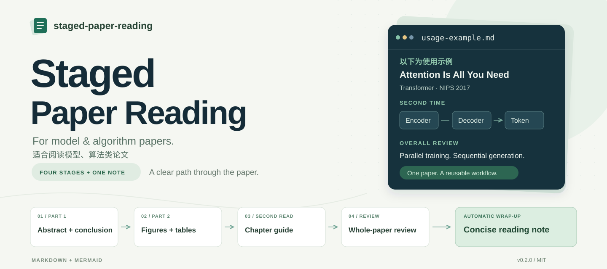

<p align="center">
  
</p>

<p align="center">
  <strong>面向模型与算法类论文，用四次导读理解，再自动整理成笔记。</strong>
</p>

<p align="center">
  简体中文 · 分阶段阅读 · 全部图表 · 精简笔记 · Mermaid<br>
  <code>v0.2.0</code> · <a href="LICENSE">MIT License</a>
</p>

<p align="center">
  <a href="#workflow">阅读流程</a> ·
  <a href="#start">快速开始</a> ·
  <a href="#notes">笔记示例</a> ·
  <a href="#files">文件结构</a>
</p>

---

一个主要适合阅读**模型、算法类论文**的通用 skill：从标题、摘要和结论建立全貌，逐个读懂图表，再顺着正文理解方法，最后把证据与限制整理成精简笔记。

适用于模型架构、训练方法、优化与算法设计等论文。根据当前论文组织内容，关注模型结构或算法步骤、输入输出、实验或理论证据。

支持本地 PDF、论文链接和正文。用户提供笔记样例时，继承其组织方式与表达习惯；未提供样例时使用内置模板。

| 📖 理解论文 | 🔎 看清证据 | 📝 留下笔记 |
|---|---|---|
| 精读摘要与结论，按章节连接方法 | 图表全部覆盖，保留指标与比较条件 | 少量要点、必要公式、一张关键流程图 |

<a id="workflow"></a>
## 阅读流程


| 阶段 | 阅读内容 | 交互方式 |
|---|---|---|
| **第一次阅读 Part 1** | 标题、必要作者介绍、摘要精读与四要素、结论精读、形象比喻 | 完成后等待“继续” |
| **第一次阅读 Part 2** | 按原文顺序详解全部图表，标记一张最重要的图 | 询问是否进入第二次阅读 |
| **第二次阅读** | 从引言到实验之前，按章节速读；所有章节放在同一次回答中 | 询问是否通篇总结 |
| **通篇总结** | 贡献、优点、不足、相关工作、延伸、适合读者 | 总结后**自动生成阅读笔记** |

追问术语、公式或某张图时，停留在当前阶段。可以明确要求重读、跳过、改变顺序，或延后笔记。

没有独立结论或由其他章节承担结论功能时，先说明并询问阅读安排；没有实验时，第二次阅读到结论之前。具体规则见 [结构适配](skills/staged-paper-reading/references/structure-adaptation.md)。

<a id="start"></a>
## 快速开始

**1. 放入 skill 目录**

将 [skills/staged-paper-reading](skills/staged-paper-reading/) 整个目录复制到所用工具支持的 skills 目录。Codex 可使用用户级或项目级的 .codex/skills；其他工具按其技能发现规则配置。

**2. 提供论文与可选笔记样例**

```text
$staged-paper-reading 带我读这篇论文，从第一次阅读 Part 1 开始。
这是我的笔记样例，最后按这个风格生成精简阅读笔记。
```

**3. 按节奏推进**

```text
继续。
这个公式里的 Q、K、V 分别是什么？
重新解释 Table 2，保持在当前阶段。
继续通篇总结。
```

前三阶段在停止点等待。第四阶段完成总结并自动交付 Markdown 笔记；已有完整阅读记录时，也可以直接要求“根据已读内容生成阅读笔记”。

> skill 使用当前环境可用的文件与阅读工具，无固定操作系统、个人目录或 PDF 库依赖。保存文件与图形预览取决于运行工具的能力。

<a id="notes"></a>
## 笔记长什么样？

采用 **First Time → Second Time → Overall Review** 的组织方式。普通小节保留少量要点，方法部分保留关键流程和必要公式。

| 分组 | 留下什么 |
|---|---|
| **First Time** | 摘要四要素与动机、结论、图表编号和精简结论 |
| **Second Time** | 正文章节主线、核心公式、可编辑的模型或算法流程图 |
| **Overall Review** | 六个简短评价：贡献、优点、不足、定位、延伸、适合读者 |

图表详解仍覆盖全部已提供图表。**笔记不粘贴原论文图片或截图**；关键模型流程用 Mermaid 重新组织，保留正确的信息来源、掩码和重复结构。

### 使用示例：Attention Is All You Need

> **以下为使用示例。** 用 Transformer 论文展示阅读流程与笔记格式；这套工作流可用于其他模型与算法类论文。

[打开精简阅读笔记 →](examples/attention-is-all-you-need.md)

示例保留了 28.4 / 41.0 BLEU 的比较范围、测试集与开发集的区别，以及位置编码外推尚未验证的边界。来源为 [NIPS 2017 论文 PDF](https://proceedings.neurips.cc/paper_files/paper/2017/file/3f5ee243547dee91fbd053c1c4a845aa-Paper.pdf)。

<details>
<summary><strong>使用示例：自行绘制的 Transformer 流程图</strong></summary>

<p align="center">
  
</p>

对应的 Mermaid 源码保存在示例笔记中，可继续编辑。图中合并了残差、dropout 和归一化的细节。

</details>

<a id="files"></a>
## 文件结构

```text
.
├── README.md
├── LICENSE
├── assets/                         # GitHub 封面与社交预览图
├── examples/
│   ├── attention-is-all-you-need.md
│   └── assets/                     # 自行绘制的示例流程图
└── skills/staged-paper-reading/
    ├── SKILL.md
    ├── LICENSE
    ├── assets/reading-note-template.md
    └── references/
        ├── first-read.md
        ├── figures-and-tables.md
        ├── second-read-and-summary.md
        ├── structure-adaptation.md
        └── reading-notes.md
```

入口：[SKILL.md](skills/staged-paper-reading/SKILL.md) · 笔记规则：[reading-notes.md](skills/staged-paper-reading/references/reading-notes.md) · 模板：[reading-note-template.md](skills/staged-paper-reading/assets/reading-note-template.md)

## 使用约定

- 以提供的论文版本为准；关键事实回到原文核对。
- 区分作者主张、实验支持、解释和研究设想。
- 用户样例用于学习笔记格式，论文和附件作为分析材料。
- 已有笔记默认保留，新生成的笔记保存为独立文件；合并与替换按用户要求。
- 不把读懂论文写成已经完成复现，也不凭小幅分数差异断言稳定优势。

## 试用状态

四阶段标准流程已用一篇会议论文完成首次试读；v0.2.0 新增笔记任务已生成对应精简示例并检查流程图。无结论、无实验、无图表等分支已做规则检查，尚未逐项真实试用。

## 来源与许可

基于 Academic Research Skills 的 paper-reading（原作者署名 **weed**，版本 1.0.0，MIT）改编，保留直观解释、模块化阅读、图表公式解说与专家点评思路，重写为四阶段交互，并加入精简笔记收尾任务。

原始许可保留在根目录与 skill 目录的 [LICENSE](LICENSE)。示例为基于论文内容重新整理的阅读笔记，不包含原论文文件或原图。

Mermaid 在 GitHub Markdown 中的使用方式见 [GitHub 官方文档](https://docs.github.com/en/get-started/writing-on-github/working-with-advanced-formatting/creating-diagrams)。
