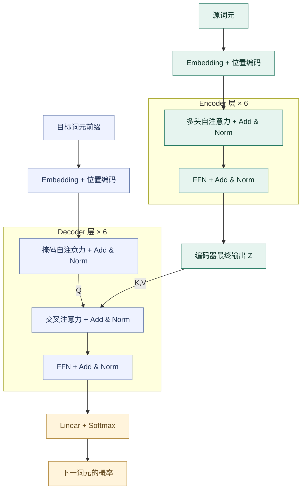

# Attention Is All You Need

> Vaswani et al. · NIPS 2017 会议版 · [原文 PDF](https://proceedings.neurips.cc/paper_files/paper/2017/file/3f5ee243547dee91fbd053c1c4a845aa-Paper.pdf)

> **使用示例：** 本笔记展示 staged-paper-reading 的输出格式；该 skill 主要适合模型、算法类论文，工作流可用于不同论文。

# First Time

## 1. Abstract

- **问题：** 循环网络沿词元逐步计算，限制同一序列内部的训练并行度。
- **动机：** 注意力能够直接联系远处位置，但当时通常仍与循环网络配合。
- **方法：** 用多头注意力组织 encoder–decoder，移除循环与卷积主干。
- **结果：** big 模型在 WMT 2014 英德、英法测试中分别达到 **28.4、41.0 BLEU**。
- **意义：** 在这些翻译设置下，兼顾质量与训练效率；8 张 P100 上训练 big 约 3.5 天。

## 2. Conclusion

- **贡献：** 将自注意力、交叉注意力、FFN 与位置编码组合成完整 Transformer。
- **结果：** 英德超过表中最佳先前集成；英法超过先前单模型，仍低于表中最佳集成。
- **展望：** 其他模态、局部注意力、更少串行步骤的生成，均是后续研究方向。（§7）

## 3. Figure & Table

- **⭐ Fig 1：** 核心架构图。编码器形成源句表示；解码器读取目标前缀和源句，再预测下一词元。箭头表示信息流。
- **Fig 2：** 左图展示“匹配 → 缩放 → softmax → 汇聚”，右图展示多个投影子空间的并行注意力与拼接。
- **Table 1：** 比较计算量、串行操作和最长路径。全局自注意力路径短，核心计算量仍为 $O(n^2d)$。
- **Table 2：** big 的英德成绩比表中最佳先前结果高 **2.04 BLEU**；英法 41.0 比最佳先前单模型 40.56 高 **0.44**，低于集成 41.29。训练成本为估算值。
- **Table 3：** 多头与适度 dropout 有益，增大深度或头数并非持续获益；位置编码两种方案接近。指标来自 **newstest2013 开发集**，未做检查点平均；不能直接与 Table 2 测试成绩混比。

# Second Time

## 1. Introduction & Background（§1–2）

瓶颈：$h_t=f(h_{t-1},x_t)$ 带来序列内串行依赖。已有卷积路线可以并行，但远处位置通常需经过多层连接。

**创新定位：** 用注意力完成序列位置之间的主要信息交互，构造完整序列转导架构；注意力与自注意力已有先行工作。

## 2. Model Architecture（§3）

### 2.1 编码器与解码器

base：编码器、解码器各 **6 层**，$d_{\mathrm{model}}=512$，**8 个头**，每头 $d_k=d_v=64$；FFN 为 $512\rightarrow2048\rightarrow512$。

*依据 Fig 1 重新绘制：同一层子结构重复堆叠，图中合并了残差、dropout 与 LayerNorm；Add & Norm 是子层输出经 dropout 后与输入相加，再归一化。*

**训练与推理：** 训练时输入右移，因果掩码遮住未来位置，可同时预测多个位置；推理时仍逐词生成。交叉注意力的 $Q$ 来自解码器，$K,V$ 来自编码器。

### 2.2 Attention

$Q$ 查询、$K$ 匹配、$V$ 内容：

$$
\operatorname{Attention}(Q,K,V)
=\operatorname{softmax}\left(\frac{QK^\top}{\sqrt{d_k}}+M\right)V.
$$

$M$ 为讲解中显式写出的掩码：允许位置为 0，禁止位置为 $-\infty$；原文公式 (1) 未写 $M$，正文说明了 masking。多头分别投影、计算，再沿特征维拼接。

### 2.3 FFN、Embedding 与位置编码

$$
\operatorname{FFN}(x)=\max(0,xW_1+b_1)W_2+b_2.
$$

FFN 逐位置加工特征，同一层各位置共享参数。入口 embedding 将编号变为向量，出口 Linear + Softmax 产生词表概率。

固定正弦、余弦位置编码与 embedding 相加。作者提出它可能适用于更长序列，但本文实验未验证长度外推。

## 3. Why Self-Attention（§4）

比较三件事：每层计算量、串行操作数、远距离传播路径。自注意力缩短路径并提高并行度，全局注意力仍需计算大量位置关系；局部注意力可以降低成本，但会增加跨远处位置的路径。

## 4. Training（§5）

- **数据：** WMT 2014；英德约 450 万句对，BPE 共享词表约 37,000。按近似长度组批，每批源/目标各约 25,000 词元。
- **优化：** Adam，$\beta_1=0.9,\ \beta_2=0.98,\ \epsilon=10^{-9}$；4000 步 warmup 后，学习率按步数平方根倒数下降。
- **正则化：** base 的 dropout、标签平滑均为 0.1；标签平滑可使 BPE 词元级 PPL 变差，却改善 BLEU。
- **资源：** 8 张 P100；base 10 万步约 12 小时，big 30 万步约 3.5 天。

# Overall Review

- **贡献：** 给出可并行训练的注意力序列转导架构及缩放点积、多头设计。
- **优点：** 信息路径短，矩阵运算清晰；整体翻译结果与部分消融提供支持。
- **不足：** 长序列注意力成本高，生成仍串行；缺少多次运行统计和长度外推验证。
- **定位：** 继承 encoder–decoder、已有注意力及训练组件，改变序列主干。
- **延伸：** 固定与可学习位置编码超出训练长度后如何表现？**待验证**。
- **适合：** 已接触神经网络训练，希望理解注意力数据流与实验边界的读者。
