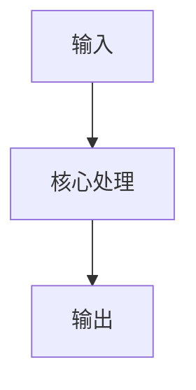

# 论文题名

# First Time

## 1. Abstract

- **问题：** 核心研究问题。
- **动机：** 已有方法的主要缺口。
- **方法：** 本文的核心方案。
- **结果：** 关键结果及比较条件。
- **意义：** 在证据范围内说明价值。

## 2. Conclusion

- **贡献：** 主要贡献。
- **结果：** 已验证的结论。
- **展望：** 作者计划或待验证方向。

没有独立结论时，替换为实际结构及已确定的替代/跳过安排。

## 3. Figure & Table

- **⭐ Fig：** 最重要图的机制或证据，附原编号。
- **Fig / Table：** 其他图表按原文顺序保留简短结论与必要边界。

# Second Time

## 1. Introduction / Background

研究背景、瓶颈与创新定位。

## 2. 核心方法（使用论文实际标题）

输入 → 核心处理 → 输出；保留理解必需的公式与符号。

把示意替换为论文实际结构；图旁说明简化项。

## 3. 其余已读章节（按原文结构增删）

每节 1–3 个短要点；保留关键分析或训练设置。

# Overall Review

- **贡献：** 核心新增内容。
- **优点：** 有价值的设计及证据。
- **不足：** 限制与缺少的验证。
- **定位：** 与先行工作的关系。
- **延伸：** 一个待验证的问题或方向。
- **适合：** 阅读背景与目标。
